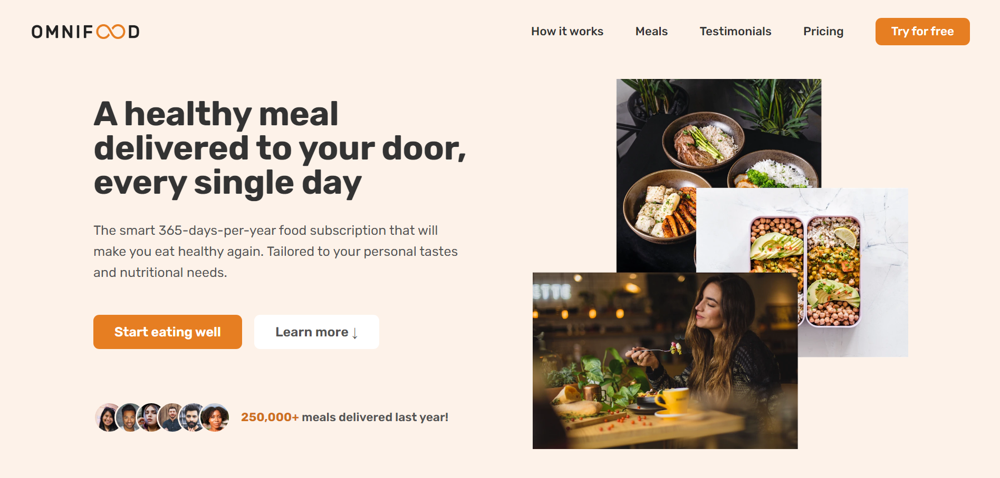

# Omnifood-Project

Omnifood is a fictional food delivery service website, created as part of the "Build Responsive Real-World Websites with HTML and CSS" course by Jonas Schmedtmann. This project showcases modern web design techniques, focusing on building a responsive, user-friendly website. The site aims to provide an attractive and functional user experience, adapting seamlessly to various devices and screen sizes.

## Features

- **Responsive Design:** Fully responsive layout that adapts to different screen sizes, providing an optimal viewing experience on desktops, tablets, and mobile devices.

- **Modern HTML & CSS:** Utilizes the latest HTML5 and CSS3 features for a clean and maintainable codebase.
- **Flexbox & Grid:** Advanced layout techniques using CSS Flexbox and Grid for precise and flexible design.
- **Animations:** Smooth and engaging animations that enhance the user experience.
- **Form Validation:** Interactive forms with basic validation to improve usability.

- **Performance Optimization:** Best practices implemented for fast loading times and high performance.

## Recommendation

I highly recommend the "Build Responsive Real-World Websites with HTML and CSS" course by Jonas Schmedtmann. It is an excellent resource for anyone looking to learn modern web design principles and techniques. The course provides hands-on experience through the Omnifood project, making it an engaging and practical way to develop your skills.
